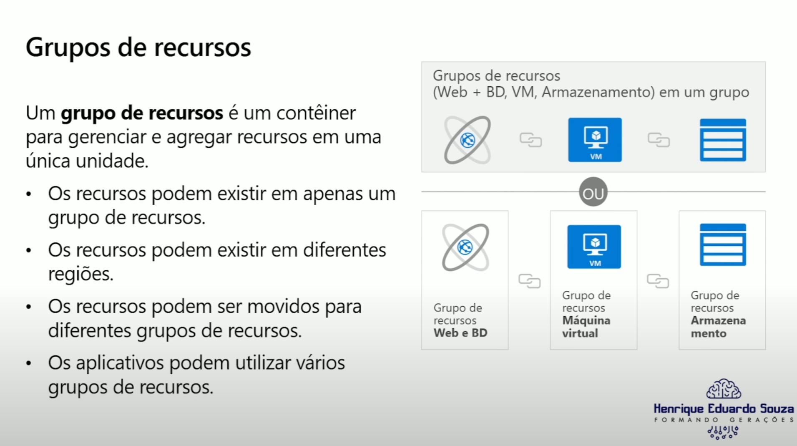
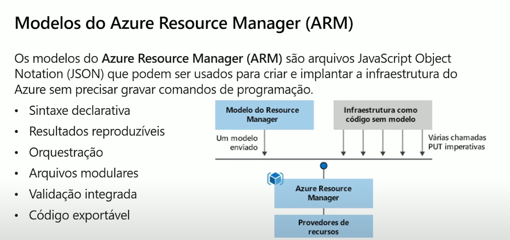
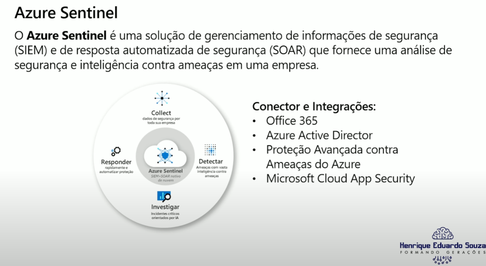
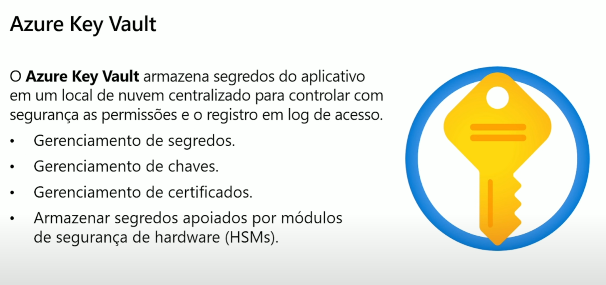
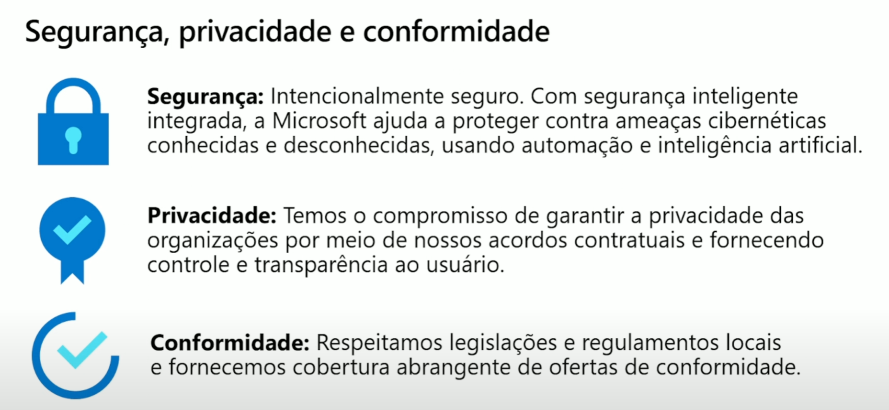
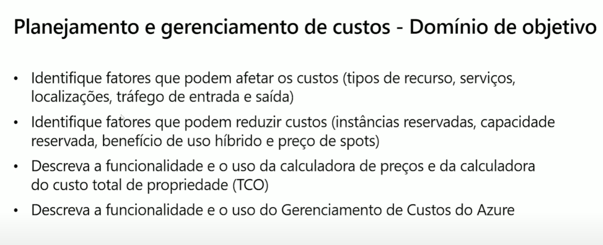
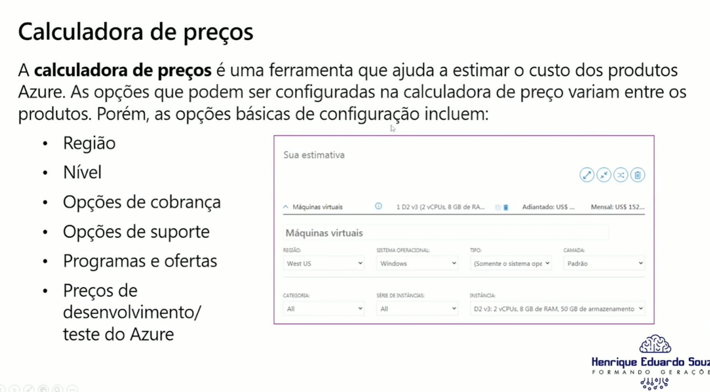

#### TCO ou Total Cost of Ownership calculator <spanp style="color:98968;">-></spanp> é responsavel quando se quer migrar a sua infra local para a azure ela ajuda na estimativa de preço nela tambem conseguimos ver a discrepancia de valor entre o CAPEX e OPEX.

#### Azure Advisor <spanp style="color:98968;">-></spanp> fornece recomendações de disponibilidade, segurança, desempenho, excelencia operacional e custo.

#### Regions ou Região <spanp style="color:98968;">-></spanp> é onde os datacenters da microsoft azure são organizados e disponibilizados por região.

#### Availability Sets <spanp style="color:98968;">-></spanp> os availability sets fornecem redundancia e disponibilidade de VM.

#### NSG ou network security group <spanp style="color:98968;">-></spanp> permite que você filtre o trafego de rede para os recursos do azure em uma rede virtual do azure e ela pode conter varias regras de segurança de entrada e saida por recurso e endereço de IP de origem e destino, porta e protocolo.

#### azure key vault <spanp style="color:98968;">-></spanp> permite armazena senhas no azure para que você possa gerencia-las centralmente para seus serviços e aplicativos.

#### Service Trust Portal ou STP <spanp style="color:98968;">-></spanp> é utilizado para baixar relatorios de auditoria publicados e como a microsoft constroi e opera seus serviços em nuvem

#### Azure service health <spanp style="color:98968;">-></spanp> responsavel por fornecer informações sobre manutenção planejada e mudanças que podem afetar a disponibilidade de seus recursos.

##### Microsoft Privacy Statement <spanp style="color:98968;">-></spanp> fornece detalhes sobre os dados pessoais que a microsoft processa, como a microsoft os processa e para quais finaludades.

#### Azure Policy -> pode ser usada para ajuda-lo a aplicar a marcação de recursos para que você possa gerenciar o faturamento criando uma regra especifica para cada serviço criado ele ter uma tag padrão.

#### Azure Blueprint -> pode ser usada para definir um conjunto repetivel de recursos do azure que implementam requisitos organizacionais.

#### Role-Based Access Control ou RBAC-> permite que você conceda aos usuarios apenas os diretos de que precisam para realizar seus trabalhos.

#### SSO ou single sign-on-> ajuda a desativar uma conta com mais facilidade quando um funcionario sai da empresa e essa desabilitação acontece em apenas uma única etapa.

#### AIP ou Azure Information Protection -> classifica e protege documentos e emails aplicando etiquetas.

#### Um Circuito ExpressRoute com Conectividade de volta à sua rede local -> é um bom uso de um bloqueio de recurso.

#### Crie uma Política com seus requisitos de nomeclatura -> é a maneira mais eficiente de garantir que uma convenção de nomeclatura fosse seguida.

#### Economia de escala -> descreve os benefícios de serviçõs em nuvem

#### CapEx ou Despesas de capital -> se refere a gastar dinheiro adiantado e deduzir essa despesa ao longo do tempo.

#### Alta disponibilidade -> se refere à disponibilização de um serviço sem tempo de inatividade por um longo período de tempo.

#### Elasticidade -> é visto como um beneficio do uso de serviços em nuvem.

#### A mudança reduz as despesas de capital CapEx -> é uma das vantagens de mover sua infraestrutura para o azure ou qualquer nuvem.

#### Nuvem Privada -> modelo de nuvem que fornece o maior grau de propriedade e controle.

#### Nuvem Hibrida -> se tem apps legados que requerem hardware de mainframe e tem apps compartilhados mais recentes.

O que é computação em nuvem? --> É a entrega de serviços de computação por meio da internet,possibilitando uma inovação mais rápida, recursos flexíveis e economia de escala.

- Nuvem Pública
- Nuvem Privada
- Nuvem Hibrida

Benefícios da Nuvem

- Alta disponibilidade
- Escalabilidade
- Alcance global
- Agilidade
- Recuperação de desastre
- Tolerância a falhas
- Elasticidade
- Capacidade de latência do cliente
- Considerações sobre custo preditivo
- Segurança

Uma assinatura é uma unidade logica

Os Grupos de recursos não podem ser aninhados

